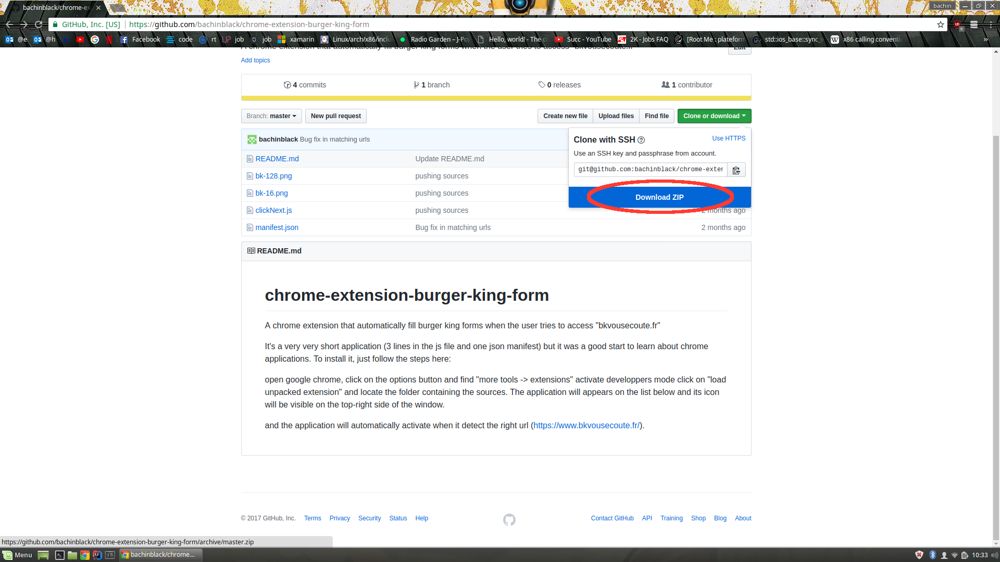
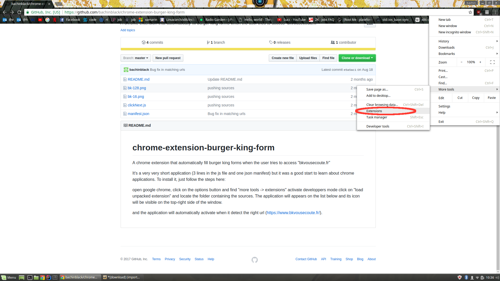
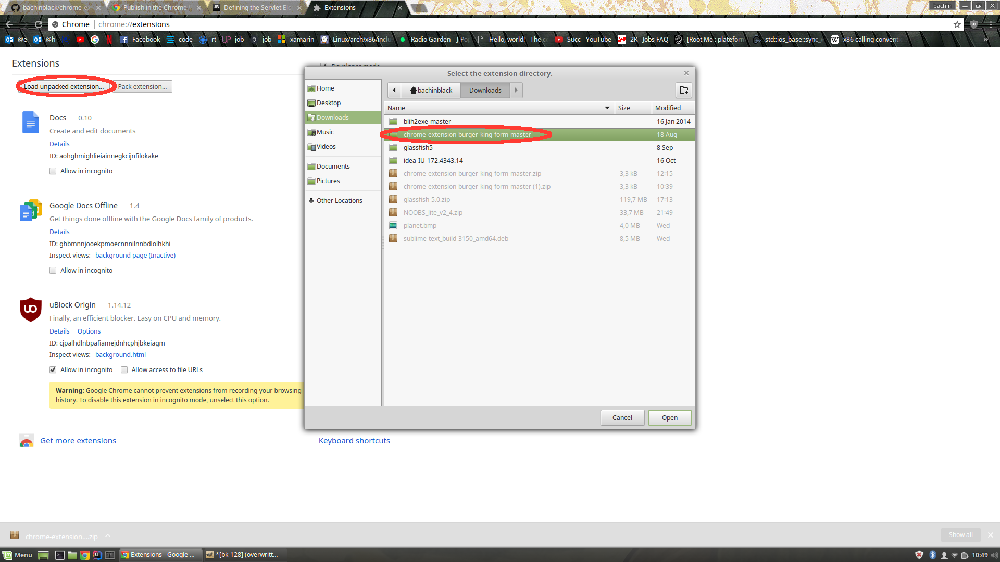

# chrome-extension-burger-king-form
A chrome extension that automatically fill burger king forms when the user tries to access "bkvousecoute.fr"

It's a very very short application (3 lines in the js file and one json manifest) but it was a good start to learn about chrome applications. To install it, just follow the steps here:

open google chrome, click on the options button and find "more tools -> extensions"
activate developpers mode
click on "load unpacked extension" and locate the folder containing the sources.
The application will appears on the list below and its icon will be visible on the top-right side of the window.

and the application will automatically activate when it detect the right url (https://www.bkvousecoute.fr/).

FR:

Télécharger l'archive zip du projet et l'éxtraire

Ouvrir options (en haut a droite) -> plus d'outils -> extensions

Cocher la case "mode développeur" en haut de la page
Ajouter l'application a la liste de vos extensions

l'application détectera automatiquement vos visites sur le site https://www.bkvousecoute.fr/ et remplira le formulaire pour vous en moins de 10s.
